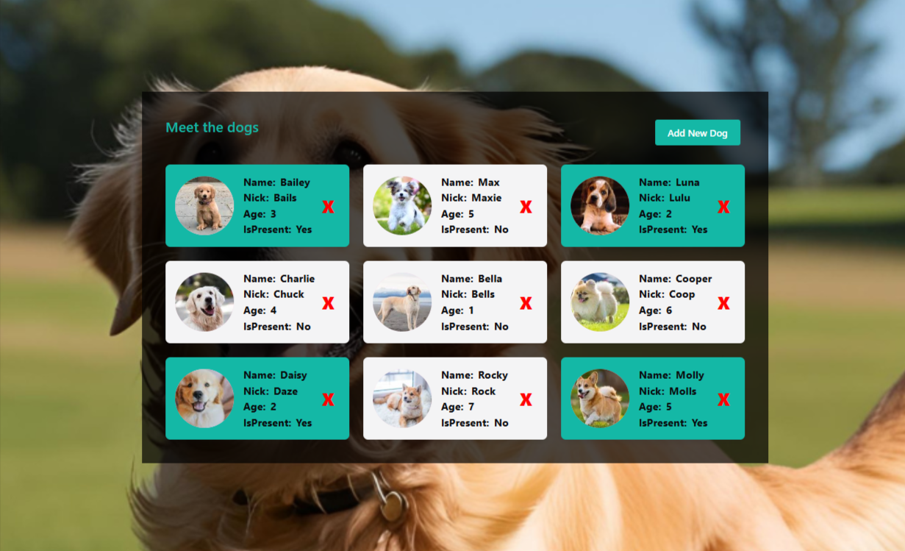
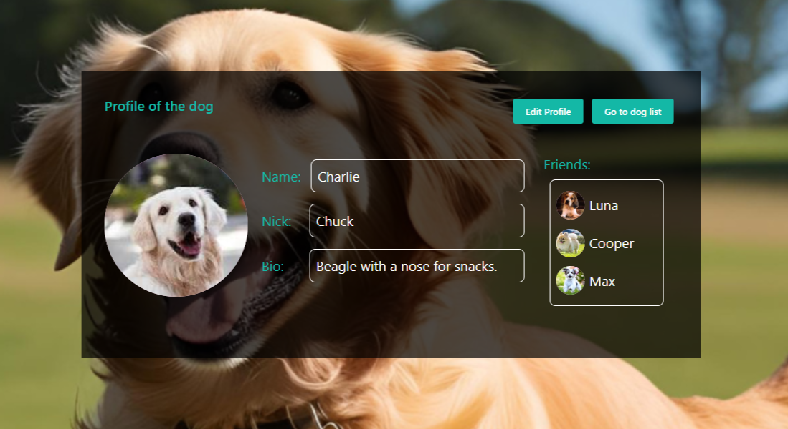
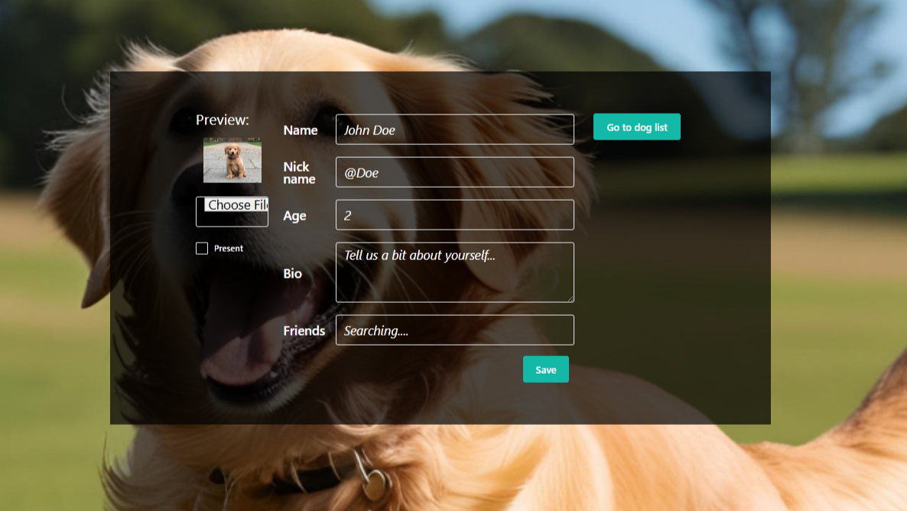
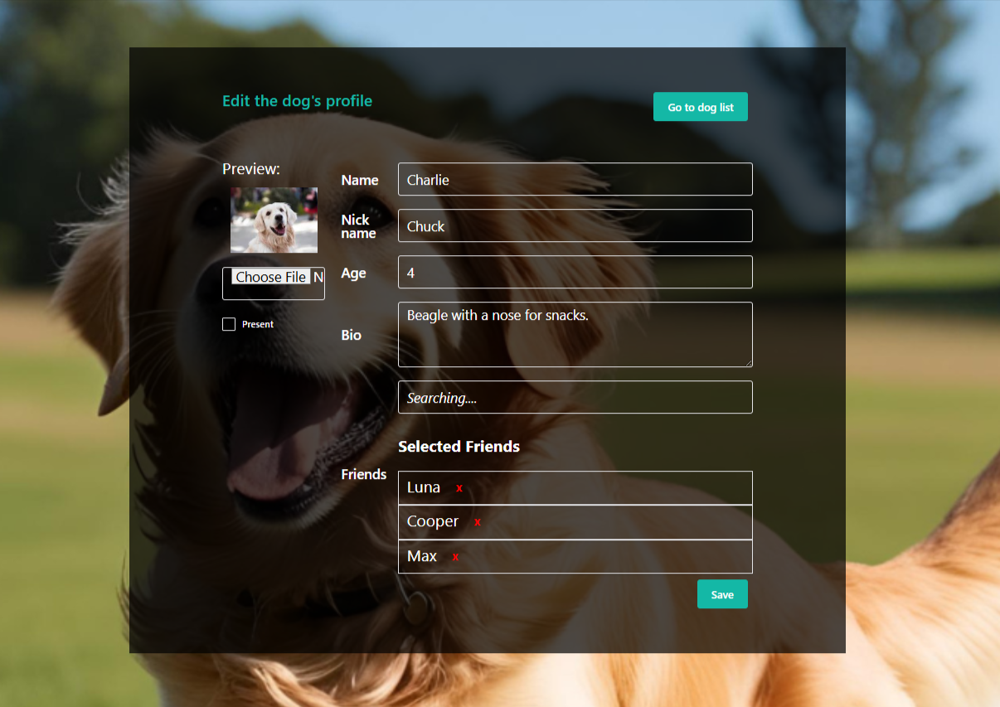

🐶 Dog Book
A React-based web app to view, manage, and explore dog profiles. Built as a school project to learn modern front-end development, API integration, and UI libraries like Chakra UI.

✨ Features
📋 View a list of dogs

👤 Detailed profile page for each dog

✏️ Edit dog information

🧑‍🤝‍🧑 View and navigate between dog friends

🔁 Relational links among friends (friendships are bi-directional)

📦 Backend integration via Axios

🎨 Responsive UI using Chakra UI

🛠️ Tech Stack
Frontend: React, React Router, Chakra UI

HTTP Client: Axios

Testing: Jest, React Testing Library

Build Tool: Vite (or CRA, depending on your setup)

🚀 Getting Started

1. Clone the repository
   To get started with this project, first, clone the repository:

bash
Kopiera
Redigera
git clone https://github.com/toihid/dogbook-react.git 2. Frontend Setup
Navigate to the frontend directory and install the necessary dependencies:

bash
Kopiera
Redigera
cd dogbook-react/frontend
npm install
npm run dev
This will start the development server, and you can open the app in your browser (typically http://localhost:3000).

🧪 Run Tests
To run tests for the project, use:

bash
Kopiera
Redigera
npm run test 3. Backend Setup
The project also includes a backend server to handle data persistence (dog profiles, friends, etc.). To set up the backend, follow these steps:

bash
Kopiera
Redigera
cd dogbook-react/backend
npm install
npm run dev
This will start the backend server (typically http://localhost:5000).

📄 License
This project is open-source and licensed under the MIT License.
Feel free to use, modify, and distribute it for educational purposes.

🙌 Acknowledgements
Built as part of a school project to practice React and full-stack development

UI inspired by clean and friendly interfaces for easy navigation

Special thanks to Chakra UI and React Router for simplifying the UI and routing setup

🚧 Future Improvements
Relational Data: Extend the "friends" feature to allow easy navigation between dog profiles.

Authentication: Add user authentication to secure dog data and profiles.

Search and Filter: Add a search bar and filter functionality for easier dog discovery.

Social Features: Include more social features such as likes, comments, or dog activities.

## 📸 Screenshots

### Dog List View

### Dog Profile Page

### Dog Add new Page

### Dog Aedit Page

